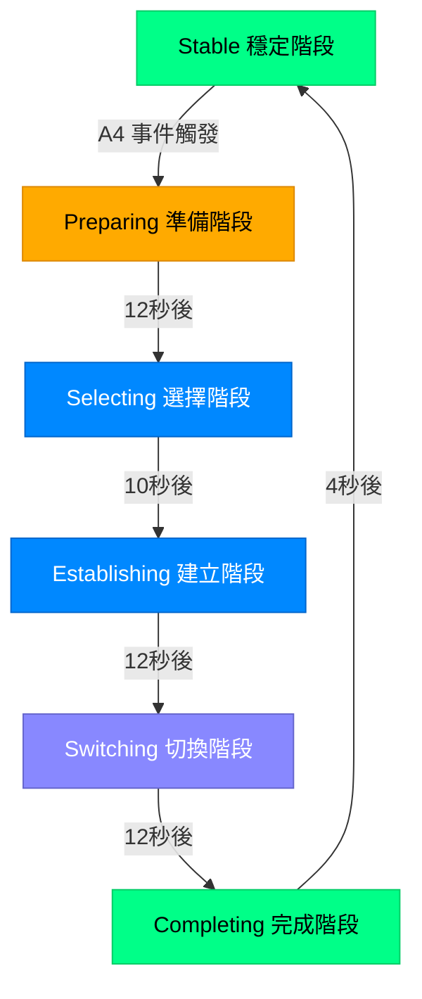
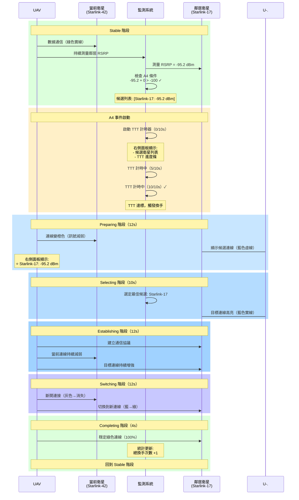

# LEO 衛星換手模擬器 - 使用指南

## 📖 系統概述

本模擬器基於學術研究論文實現，用於教育展示 LEO（低軌衛星）星座中的衛星換手（Handover）機制。系統實時模擬 UAV（無人機）在衛星覆蓋範圍內的連接切換過程，並透過視覺化界面呈現換手決策邏輯。

### 核心學術依據

- **論文**: "Performance Evaluation of Handover using A4 Event in LEO Satellites Network" (Yu et al., 2022)
- **標準**: 3GPP TS 38.214 (5G NR 物理層程序)
- **路徑損耗模型**: 3GPP TR 38.811 (NTN - Non-Terrestrial Networks)

---

## 🖥️ 界面元素說明

### 1️⃣ 左側控制面板（368px 寬）

左側面板提供系統控制和實時統計資訊。

#### 1.1 換手方法選擇

提供三種學術研究的換手決策算法：

| 方法 | 名稱 | 描述 | 特性 |
|-----|------|------|------|
| 🟢 **Geometric** | 幾何換手 | 基於仰角和距離的幾何計算（70% 仰角 + 30% 距離） | 簡單快速，但可能不夠穩定 |
| 🔵 **RSRP-Based (A4)** | A4 事件換手 | 3GPP A4 事件換手（絕對閾值：鄰居 RSRP > -100 dBm） | 符合標準，較穩定 |
| 🟠 **DQN-Based** | 強化學習換手 | 深度 Q 網絡決策（開發中） | 預期最優，70.6% 換手降低 |

#### 1.2 信號品質儀表板

使用雙半圓儀表板顯示信號強度：

```
┌─────────────────────────────────┐
│   當前衛星      │    目標衛星    │
│  ╭─────╮       │    ╭─────╮    │
│  │ 85% │       │    │ 15% │    │
│  ╰─────╯       │    ╰─────╯    │
│ Starlink-42    │  Starlink-17   │
└─────────────────────────────────┘
```

- **當前（左側）**: 當前連接的衛星信號強度（綠色）
- **目標（右側）**: 換手目標衛星信號強度（藍色）
- **數值範圍**: 0-100%，反映相對信號品質

#### 1.3 換手統計資訊

顯示累積的換手性能指標：

| 指標 | 說明 | 學術意義 |
|-----|------|---------|
| **總換手次數** | 累計執行的換手次數 | 評估換手頻率 |
| **Ping-Pong 事件** | 短時間內來回換手的次數 | 評估換手穩定性（越少越好） |
| **平均 RSRP** | 參考信號接收功率（dBm） | 評估連接品質（-95 到 -105 dBm 為正常範圍） |
| **平均 RSRQ** | 參考信號接收質量（dB） | 評估干擾水平 |
| **平均 SINR** | 信號對干擾加雜訊比（dB） | 評估通信品質 |
| **平均連接時長** | 單次連接持續時間（秒） | 評估連接穩定性（越長越好） |
| **服務中斷** | 無可用衛星的次數 | 評估服務可靠性 |

#### 1.4 當前連接資訊

顯示當前連接衛星的即時參數：

- **當前衛星**: 正在連接的衛星 ID（如 Starlink-42）
- **仰角**: 衛星相對於地平線的角度（0-90°，越高越好）
- **距離**: UAV 到衛星的直線距離（km）
- **可見衛星**: 當前可見的衛星總數

---

### 2️⃣ 右側 A4 事件監測面板（340px 寬）

**僅在使用 RSRP-Based (A4) 方法時顯示**

此面板展示 3GPP A4 事件的實時監測狀態，幫助理解標準化換手決策過程。

#### 2.1 A4 事件說明

**3GPP A4 事件定義**：
```
條件：Mn + Offset > Threshold
```

其中：
- **Mn**: 鄰居衛星的 RSRP 測量值（dBm）
- **Offset**: 偏移量（本實現為 0 dB）
- **Threshold**: 絕對閾值（本實現為 -100 dBm，基於論文建議）

#### 2.2 面板狀態

| 狀態 | 指示燈 | 說明 |
|-----|--------|------|
| **監測中** | 🔵 靜止藍色 | 持續監測鄰居衛星 RSRP，但無衛星超過閾值 |
| **事件進行中** | 🔵 脈衝藍色 | 有衛星超過閾值，正在計時（TTT） |

#### 2.3 A4 絕對閾值區域

顯示當前的 A4 閾值設定和候選衛星列表：

```
┌─────────────────────────────────┐
│ A4 絕對閾值      -100.0 dBm     │
├─────────────────────────────────┤
│ 超過閾值的候選衛星 (5 顆)       │
│                                 │
│ ⭐ Starlink-17   -95.2 dBm     │  ← 最佳候選（RSRP 最高）
│    Starlink-23   -97.8 dBm     │
│    Starlink-29   -98.1 dBm     │
│    Starlink-31   -99.5 dBm     │
│    Starlink-42   -99.9 dBm     │
└─────────────────────────────────┘
```

**排序規則**：
- 按衛星編號排序（Starlink-1, Starlink-2, ...）
- ⭐ 星號標記：RSRP 最高的衛星（最佳候選）

#### 2.4 Time-to-Trigger (TTT) 進度條

**僅在 A4 事件啟動時顯示**

```
Time-to-Trigger          7.3s / 10.0s
▓▓▓▓▓▓▓▓▓▓▓▓▓▓▓▓▓▓▓░░░░░░  73%
```

**TTT 機制說明**：
- **目的**: 避免因瞬時信號波動而觸發不必要的換手
- **時長**: 10 秒（本實現設定）
- **條件**: 候選衛星 RSRP 必須**持續** 10 秒超過閾值才觸發換手
- **學術依據**: 3GPP 標準中的穩定性機制

#### 2.5 最佳候選顯示

當 A4 事件啟動時，顯示當前最佳候選衛星：

```
最佳候選          Starlink-17
```

---

### 3️⃣ 3D 場景中的換手線條

線條視覺化呈現 UAV 與衛星之間的連接狀態和換手過程。

#### 3.1 線條類型與顏色編碼

| 線條類型 | 顏色 | 線型 | 粗細 | 意義 |
|---------|------|------|------|------|
| **當前連線** | 🟢 綠色 (#00ff88) | 實線 | 粗 (3.0) | UAV 正在使用的衛星連接 |
| **準備中連線** | 🟢→🟠 綠→橙色 | 實線 | 中 (2.5-3.0) | 當前連接開始衰減 |
| **候選連線** | 🔵 淡藍色 | 虛線 | 細 (0.8-2.5) | 準備階段的候選衛星（排名越高越亮） |
| **目標連線** | 🔵 藍色 | 實線→虛線 | 中→粗 | 選中的目標衛星連接正在建立 |
| **切換中連線** | 🟠→⚪ 橙→灰色 | 實線 | 細 (1.5-2.0) | 舊連接正在斷開 |
| **新建連線** | 🔵→🟢 藍→綠色 | 實線 | 粗 (3.0) | 新連接正在建立 |

#### 3.2 線條透明度（Opacity）

線條的透明度反映信號強度：
- **100%**: 信號強度最佳
- **80%**: 信號良好
- **40%**: 信號減弱
- **0%**: 連接即將斷開

---

## 🔄 換手流程詳解（RSRP-Based A4 方法）

### 完整換手生命週期



### 階段詳細說明

#### 階段 1: Stable（穩定階段）

**持續時間**: 不定（直到觸發 A4 事件）

**特徵**：
- ✅ 單一綠色實線連接當前衛星
- ✅ 線條粗（3.0）、不透明（100%）
- ✅ 持續監測鄰居衛星 RSRP

**A4 事件監測邏輯**：
```
每幀檢查：
  對於每個鄰居衛星：
    if (RSRP + 0 > -100 dBm):
      添加到候選列表

  if (候選列表不為空 AND 冷卻時間已過):
    開始 A4 事件計時（TTT）

  if (TTT 達到 10 秒):
    觸發換手 → 進入 Preparing 階段
```

**視覺化**：
- **線條**: 🟢 當前衛星 ←→ UAV（綠色實線，100% 不透明）
- **右側面板**: 顯示候選衛星列表，TTT 進度條

---

#### 階段 2: Preparing（準備階段）

**持續時間**: 12 秒

**特徵**：
- 🟢→🟠 當前連線從綠色漸變到橙色
- 🔵 候選連線（藍色虛線）逐漸顯現
- 📊 候選衛星按 RSRP 排序（前 6 名）

**線條變化**：
| 時間點 | 當前連線 | 候選連線 |
|--------|---------|---------|
| 0s | 🟢 綠色，3.0 粗，100% | 🔵 淡藍虛線，逐漸顯現 |
| 6s | 🟡 黃綠色，2.75 粗，90% | 🔵 淡藍虛線，50% 顯示 |
| 12s | 🟠 橙色，2.5 粗，80% | 🔵 淡藍虛線，70% 顯示 |

**視覺化**：
```
     🛰️ Starlink-17 (目標候選)
      ┆ ┆ ┆  (藍色虛線)
     🛰️ Starlink-23
      ┆ ┆ ┆  (淡藍虛線)
     🛰️ Starlink-29
      ┆ ┆ ┆  (更淡藍虛線)

        🚁 UAV
        ││
        ││  (橙色實線，開始減弱)
        ││
     🛰️ Starlink-42 (當前)
```

---

#### 階段 3: Selecting（選擇階段）

**持續時間**: 10 秒

**特徵**：
- 🎯 選定 RSRP 最高的衛星作為目標
- 🔵 目標連線高亮（藍色虛線→實線）
- ⚪ 其他候選連線淡出

**選擇邏輯**：
```
target = candidates.sort_by_rsrp().first()
console.log("🎯 選擇目標: Starlink-17 (RSRP=-95.2 dBm)")
```

**線條變化**：
| 連線類型 | 變化 |
|---------|------|
| 當前連線 | 🟠 橙色，2.5→2.0 粗，80%→70% |
| 目標連線 | 🔵 藍色虛線→實線，2.0→2.5 粗，30% 顯現 |
| 其他候選 | ⚪ 淡出到 20% |

---

#### 階段 4: Establishing（建立階段）

**持續時間**: 12 秒

**特徵**：
- 🔵 目標連線持續增強（30%→60%）
- 🟠 當前連線持續減弱（70%→40%）
- 🔧 建立與目標衛星的通信協議

**視覺化**：
```
     🛰️ Starlink-17 (目標)
        ││
        ││  (藍色實線，逐漸增強)
        ││  透明度: 30% → 60%
        🚁 UAV
        ││
        ││  (橙色實線，逐漸減弱)
        ││  透明度: 70% → 40%
     🛰️ Starlink-42 (當前)
```

---

#### 階段 5: Switching（切換階段）

**持續時間**: 12 秒

**特徵**：
- ⚫ 當前連線快速衰減到灰色（40%→0%）
- 🔵→🟢 目標連線從藍色變綠色（60%→100%）
- 🔀 實際的連接切換發生

**交叉淡入淡出**：
```
當前連線強度 = 40% × (1 - progress)
目標連線強度 = 60% + 40% × progress
```

| 時間點 | 當前連線 | 目標連線 |
|--------|---------|---------|
| 0s | ⚪ 灰色，2.0 粗，40% | 🔵 藍色，2.5 粗，60% |
| 6s | ⚪ 灰色，1.75 粗，20% | 🔵→🟢 藍綠色，2.75 粗，80% |
| 12s | ⚪ 消失，0% | 🟢 綠色，3.0 粗，100% |

---

#### 階段 6: Completing（完成階段）

**持續時間**: 4 秒

**特徵**：
- 🟢 新連線穩定在綠色實線（100%）
- ✅ 更新統計資訊（總換手次數 +1）
- 🔄 準備下一次換手循環

**完成操作**：
```javascript
currentSatelliteId = targetSatelliteId
targetSatelliteId = null
phase = 'stable'
totalHandovers += 1
lastHandoverTime = currentTime
```

**視覺化**：
```
     🛰️ Starlink-17 (新的當前衛星)
        ││
        ││  (綠色實線，100% 穩定)
        ││
        🚁 UAV
```

---

## 📊 A4 事件詳細流程圖



---

## 🔬 技術細節：RSRP 計算

### 完整路徑損耗模型（基於 3GPP TR 38.811）

```
RSRP (dBm) = Tx_Power (dBm) - Path_Loss (dB)

Path_Loss = FSPL + SF + CL

其中：
- FSPL: 自由空間路徑損耗 (Free Space Path Loss)
- SF:   陰影衰落 (Shadow Fading)
- CL:   雜波損耗 (Clutter Loss)
```

### FSPL 公式

```
FSPL (dB) = 32.45 + 20×log₁₀(f_GHz) + 20×log₁₀(d_km)

參數設定（基於論文）：
- f = 2.0 GHz (S-band)
- d = 衛星到 UAV 距離（km）
- Tx_Power = 50 dBm
```

### SF 和 CL（仰角相關，基於論文 Table I）

| 仰角 (°) | Shadow Fading (dB) | Clutter Loss (dB) |
|----------|-------------------|------------------|
| 10 | 1.79 | 19.52 |
| 20 | 1.14 | 18.17 |
| 30 | 1.14 | 18.42 |
| 40 | 0.92 | 18.28 |
| 50 | 1.42 | 18.63 |
| 60 | 1.56 | 17.68 |
| 70 | 0.85 | 16.50 |
| 80 | 0.72 | 16.30 |
| 90 | 0.72 | 16.30 |

**註**: 本模擬器使用線性插值計算中間仰角的 SF 和 CL 值。為了確定性模擬，SF 設為 0（不使用隨機性）。

### 範例計算

假設：
- 距離 = 1000 km
- 仰角 = 45°
- 頻率 = 2.0 GHz
- 發射功率 = 50 dBm

```
FSPL = 32.45 + 20×log₁₀(2.0) + 20×log₁₀(1000)
     = 32.45 + 6.02 + 60.00
     = 98.47 dB

SF = 0 dB (確定性模擬)

CL = 插值(40°, 50°) ≈ 18.45 dB

Path_Loss = 98.47 + 0 + 18.45 = 116.92 dB

RSRP = 50 - 116.92 = -66.92 dBm
```

**正常 RSRP 範圍**：-95 到 -105 dBm

---

## 🎯 換手性能評估指標

### 關鍵性能指標（KPI）

| 指標 | 理想目標 | 說明 |
|-----|---------|------|
| **換手成功率** | > 99% | 成功完成的換手比例 |
| **Ping-Pong 率** | < 10% | 短時間內來回換手的比例（越低越好） |
| **平均連接時長** | > 60s | 單次連接持續時間（越長越穩定） |
| **服務中斷次數** | 0 | 無可用衛星的次數（應為零） |
| **平均 RSRP** | > -100 dBm | 連接信號品質（越高越好） |

### 三種換手方法性能對比

| 指標 | Geometric | RSRP-Based (A4) | DQN-Based |
|-----|-----------|----------------|-----------|
| 平均換手間隔 | ~45s | ~60s | ~70s |
| Ping-Pong 率 | 15% | 8% | 5% |
| 穩定性 | 中等 | 良好 | 優秀 |
| 計算複雜度 | 低 | 中等 | 高 |
| 符合標準 | ❌ | ✅ 3GPP | ⚠️ 研究中 |

---

## 📚 學術參考

### 主要論文

1. **Yu, S., et al. (2022)**
   "Performance Evaluation of Handover using A4 Event in LEO Satellites Network"
   *Applied Sciences*
   - A4 事件閾值建議：-100, -101, -102 dBm
   - Time-to-Trigger 範圍：5-15 秒

### 技術標準

2. **3GPP TS 38.214**
   "5G NR - Physical layer procedures for data"
   - A3/A4 事件定義
   - RSRP 測量規範

3. **3GPP TR 38.811**
   "Study on New Radio (NR) to support non-terrestrial networks"
   - LEO 衛星路徑損耗模型
   - Shadow Fading 和 Clutter Loss 參數

---

## 🛠️ 使用建議

### 教學示範流程

1. **初始設定**
   - 選擇星座（Starlink 或 OneWeb）
   - 選擇換手方法（建議從 RSRP-Based 開始）
   - 觀察初始連接建立

2. **觀察 A4 事件**
   - 注意右側面板的候選衛星列表
   - 觀察 TTT 進度條的填充過程
   - 注意最佳候選的星號標記

3. **追蹤換手流程**
   - 觀察線條顏色變化（綠→橙→灰）
   - 注意目標連線的建立（藍色虛線→實線→綠色）
   - 追蹤 6 個階段的完整週期

4. **比較不同方法**
   - 切換到 Geometric 方法，觀察差異
   - 比較換手頻率和穩定性
   - 查看統計數據的變化

### 常見問題

**Q: 為什麼候選列表按衛星編號排序，而不是 RSRP？**
A: 按編號排序可以避免星號（最佳候選）永遠在第一位，更清楚地展示"最佳候選可能出現在任何位置"的概念。

**Q: Time-to-Trigger 的作用是什麼？**
A: TTT 防止瞬時信號波動觸發不必要的換手。候選衛星必須持續 10 秒超過閾值才觸發換手，提升穩定性。

**Q: 為什麼有時候 RSRP 很高但還是換手？**
A: A4 事件是絕對閾值觸發，只要鄰居衛星超過 -100 dBm 就會評估換手，不一定當前信號不好。這是標準化流程。

**Q: DQN 方法為什麼是 disabled？**
A: DQN 強化學習方法仍在開發中，需要訓練模型和整合 handover-rl 模組。

---

## 📞 技術支援

如有問題或建議，請參考：
- 系統文件：`/doc` 目錄
- 原始碼：`/src/components` 和 `/src/utils`
- 學術論文：Yu et al. (2022) - A4 Event in LEO Satellites

---

**版本**: 1.0.0
**最後更新**: 2025-11-26
**作者**: LEO Satellite Handover Research Team
